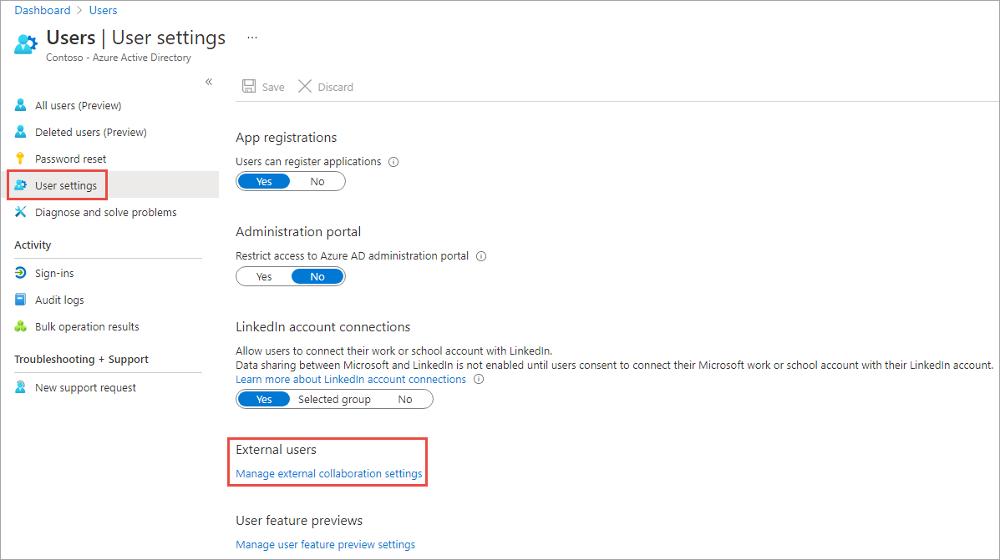
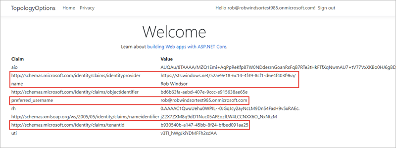

# Demo 2: Identity topology options

This exercise will demonstrate how to configure and implement an application that supports B2B.

- Use App from prev demo
- Invite guest users

## Task 1: Invite a guest user from another organization

Within a browser, navigate to the [Azure Active Directory admin center (https://aad.portal.azure.com)](https://aad.portal.azure.com) and sign in using the **Work or School Account** that has global administrator rights to your tenant where you registered the Azure AD application.

In the left-hand navigation, select **Users**.

Examine the external user settings available to administrators by selecting **User Settings** and then **Manage external collaboration settings**.

Notice that administrators can configure the Azure AD directory so guest users have limited rights compared to other users, and who can invite guest users.

Now let's invite a guest user. Select **All users** in the left-hand navigation, and then select **New guest user**:

On the **New user** page, select **Invite user**, enter the email address of a user in another Azure AD directory that you want to invite and select **Invite**. In this scenario displayed in the following screenshot, we are inviting the user we previously tried to sign in with.

Now let's try to sign in with the user. In the browser, navigate to **https://localhost:5001**.

This time, after successfully logging in, the user's Azure AD directory will prompt the them to grant the application's Azure AD directory permissions. That is to sign in as the user and obtain basic information about them.

Take note of what is happening at this point. The application's Azure AD directory is not signing in the user, rather the user has been redirected to sign in with their Azure AD directory. Once they sign in, their Azure AD directory will provide a token to the application's directory. That token is used to verify the user is authenticated and that they have authorized the application to obtain their basic profile information. The application's Azure AD then created a new access token that can be used by our ASP.NET Core web application.

After selecting **Accept**, the user is taken to our ASP.NET application. Notice the difference in some of the claims.

- The **identityprovider** claim is the ID of the Azure AD directory that authenticated the user. This claim is the user's Azure AD directory
- The **tenantid** claim is the ID of the Azure AD directory our application is registered in. Notice this value is not the same as the **identityprovider** claim, indicating the user's identity is in one directory while they have been added as a guest user to another Azure AD directory.

Stop the web server by pressing <kbd>CTRL</kbd>+<kbd>C</kbd> in the command prompt.

## Summary

In this exercise, you created an ASP.NET Core web application and an Azure AD application that allows guest users from partner Azure AD directories to sign in and access the application. You then invited a guest user to the directory and signed into the application with this user.
