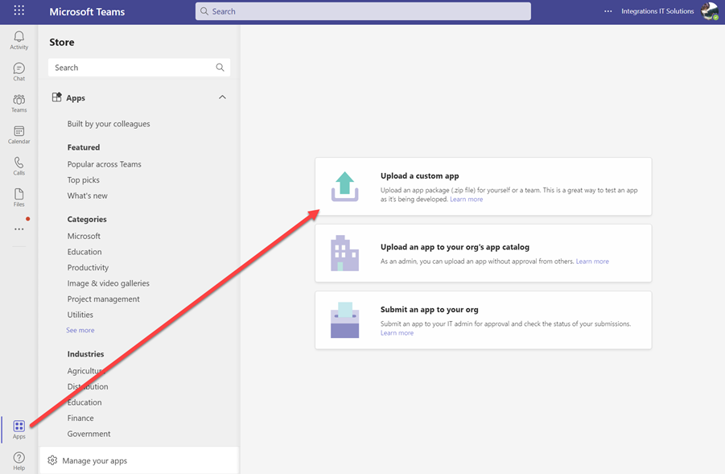

# Getting Started

[Get started with Microsoft Teams app development](https://docs.microsoft.com/en-us/microsoftteams/platform/build-your-first-app/build-first-app-overview#get-prerequisites)

[Build apps with the Teams Toolkit and Visual Studio Code](https://docs.microsoft.com/en-us/microsoftteams/platform/toolkit/visual-studio-code-overview)

## Basic Teams Workflow

Typcially Teams development is done using the web version of teams at [http://teams.microsoft.com](http://teams.microsoft.com) because it allows easy browser Dev Tools debugging.

Three scaffolding options:

-   `generator-teams@2.17.1` creates a class based structure that corresponds to the lab guides.
-   The current generator (V3.x) creates a [React Hooks](https://reactjs.org/docs/hooks-intro.html) based structure.
-   [Teams Toolkit](https://docs.microsoft.com/en-us/microsoftteams/platform/toolkit/teams-toolkit-fundamentals) also creates a different structure

Scaffolding:

```
yo teams
```

Interpolates env to manifest & create `./package/*.zip`:

```
gulp manifest
```

Build the project and create the `./dist/*` folder:

```
gulp build
```

Serve the project

```
gulp serve
```

Establish a secure tunnel to test:

```
gulp ngrok-serve [--debug]
```


>Note: Update `PUBLIC_HOSTNAME` in `.env` to use your current ngrok tunnel after restart. If you use ngkrok for the first time use `ngrok authtoken 3XjdFZdf4PgB2898gcdbu_...` to set your ngrok auth token.

To upload your app go to [http://teams.microsoft.com](http://teams.microsoft.com):



## Troubleshooting

### Webpack

Do avoid webpack size warning during you getting started process you can disable performance hints in `webpack.config.js` of your project by adding:

```json
performance: {
    hints: false
}
```


### ESlint

To disable ESlint add `*` to the `.eslintignore`

### Update Ngrok Url and re-create package

>Note: Starting with version 3.x of yeoman generator this is not needed anymore. Leaving it in here just in case some issue pops up.

To avoid having the ngrok name changed all the time use from within a Teams project in two seperate terminals, or even better run gulp start-ngrok in a seperate standalone console window.

Replace `gulp ngrok-serve` with:

```
gulp start-ngrok (from within a Teams proj)
```

```
gulp serve --debug
```


If you want to reserve a subdomain which requires a paid account you configure ngrok to use that domain with a `ngrok.yml` file:

```
authtoken: 3XjdFZdf4PgB2898gcdbu_4Rukvv4BYxxxxxxxx
tunnels:
  http-tunnel:
    proto: http
    addr: 80
    subdomain: integrationsonline
  node-tunnel:
    proto: http
    addr: 3007
    subdomain: integrationsonline
```
## Labs

[01-Tabs, Exercise 1: 01-Exercise-Create a custom Microsoft Teams personal tab](../../../Labs/4-Teams/01-Tabs/01-Exercise-Create%20a%20custom%20Microsoft%20Teams%20personal%20tab.md)
