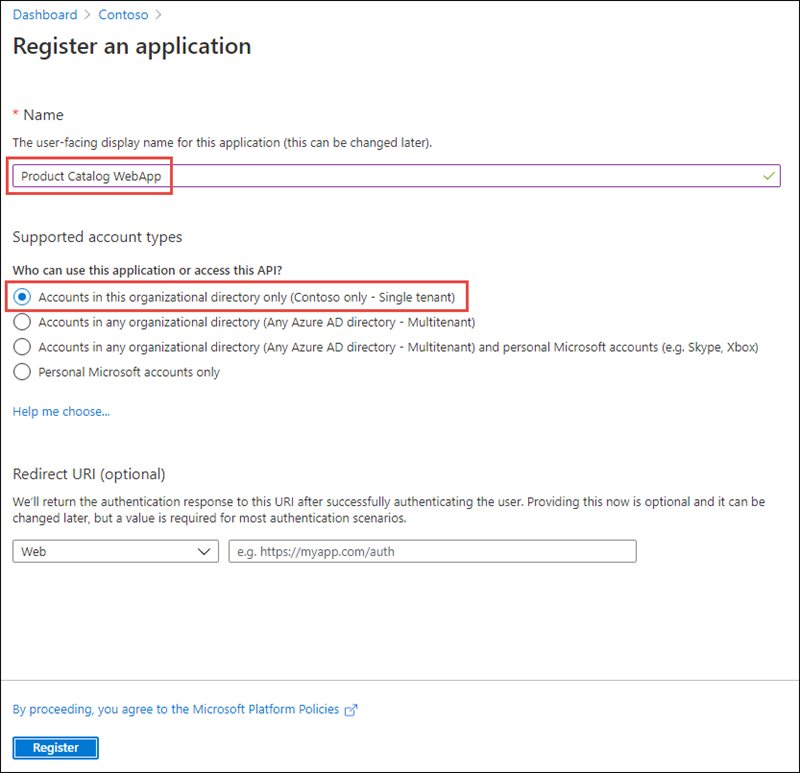
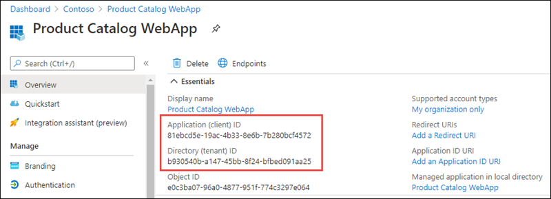
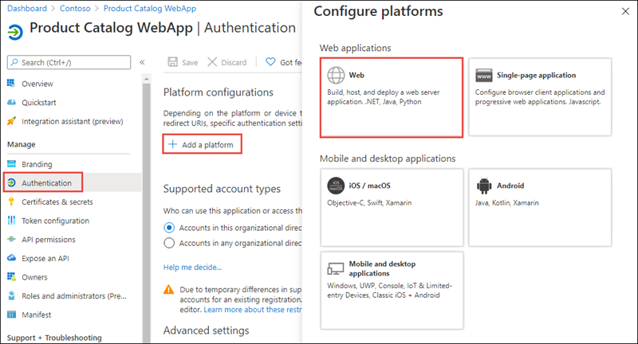
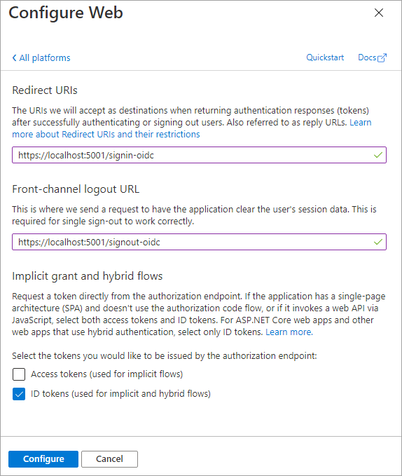
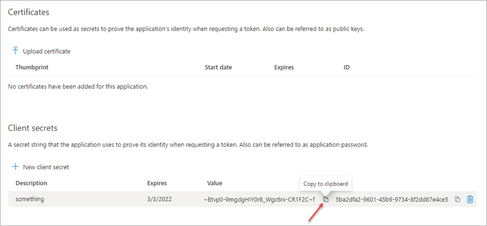
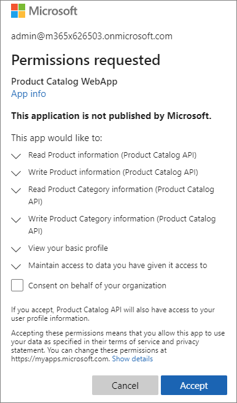

# Exercise 2: Call secured APIs from web applications

In this exercise, you’ll learn how to create server-side web apps that enable users to sign in and grant the app permissions to act on the user’s behalf. Once the user has authenticated and granted the app consent to act on their behalf, the web application will use data returned from a secure web API by using the OAuth 2.0 auth code grant flow.

> [!IMPORTANT]
> This exercise assumes you have created the secured API app registration in the Azure AD admin center and associated project from the previous unit in this module. You'll consume that API in this exercise.

## Task 1: Create an application that only allows a single organization's users to sign in

In this first application, you'll create an Azure AD application and ASP.NET Core web application that enables users from the current organization to sign in and display their information.

### Create a single-tenant Azure AD application

Open a browser and navigate to the [Azure Active Directory admin center](https://aad.portal.azure.com). Sign in using a **Work or School Account** that has global administrator rights to the tenancy.

Select **Azure Active Directory** in the left-hand navigation.


Select **Manage > App registrations** in the left-hand navigation.

On the **App registrations** page, select **New registration**.


On the **Register an application** page, set the values as follows:

- **Name**: Product Catalog WebApp
- **Supported account types**: Accounts in this organizational directory only (Single tenant)

  

Select **Register** to create the application.

On the **Product Catalog WebApp** page, copy the values **Application (client) ID** and **Directory (tenant) ID**; you'll need these values later in this exercise.



On the **Product Catalog WebApp** page, select the **Add a Redirect URI** link under the **Redirect URIs**.

Select **Add a platform**, then select **Web**.



On the **Configure Web** panel, use the following values to configure the application:

- **Redirect URIs**: https://localhost:5001/signin-oidc
- **Front-channel logout URL**: https://localhost:5001/signout-oidc
- **Implicit grant and hybrid flows**: select **ID tokens (used for implicit and hybrid flows)**

Select **Configure** when finished setting these values.



### Create a client secret for the app

In order for the app to call the web API, it must acquire an access token with the user's context. The web app will use the Authorization code flow to acquire the token. The Authorization code flow requires the web app to authenticate with an application ID and either a certificate or secret. In this exercise, you'll use a secret.

Select **Certificates & secrets** from the left-hand navigation panel.

Select the **New client secret** button:


When prompted, give the secret a description and select one of the expiration duration options provided and select **Add**. *What you enter and select doesn't matter for the exercise.*

The **Certificate & Secrets** page will display the new secret. It's important you copy this value as it's only shown this one time; if you leave the page and come back, it will only show as a masked value.



## Task 2: Create a single organization ASP.NET web application

> [!NOTE]
> The instructions below assume you are using .NET 5. They were last tested using v5.0.202 of the .NET 5 SDK.

Open your command prompt, navigate to a directory where you want to save your work, create a new folder, and change directory into that folder.

Execute the following command to create a new ASP.NET Core MVC web application:

```console
dotnet new mvc --auth SingleOrg -o ProductCatalogWeb
```

After creating the application, run the following commands to ensure your new project runs correctly.

```console
cd ProductCatalogWeb
dotnet add package Microsoft.Identity.Web
dotnet add package Microsoft.Identity.Web.UI
```

Open the scaffolded project folder, which is named **ProductCatalogWeb** in **Visual Studio Code**

### Configure the web application with the Azure AD application

Locate and open the **./appsettings.json** file in the ASP.NET Core project.

Set the `AzureAd.Domain` property to the domain of your Azure AD tenant where you created the Azure AD application (*for example: contoso.onmicrosoft.com*).

Set the `AzureAd.TenantId` property to the **Directory (tenant) ID** you copied when creating the Azure AD application in the previous section.

Set the `AzureAd.ClientId` property to the **Application (client) ID** you copied when creating the Azure AD application in the previous section.

Create a new property, `ClientSecret`, immediately after the `ClientId`. Set the value of this to the client secret you created when creating the Azure AD application in the previous section.

### Configure the web API information

The web application must know the URL and scopes required by the web API application created in the previous exercise. The scopes defined for the web API application are found in the **Expose an api** blade of the app registration in the Azure Active Directory portal. (The scopes are specified in the format `api://[client-id]/[scope]`).

In the root folder of the project, create a file named **Constants.cs**. Add the following to the file, specifying the correct value for the web API application client ID. The claim IDs (which are strings that look like a URI) that are required for token acquisition are added to the Constants class.

```csharp
using System.Collections.Generic;

namespace Constants
{
  public static class ProductCatalogAPI
  {
    public const string CategoryUrl = "https://localhost:5050/api/Categories";
    public const string ProductUrl = "https://localhost:5050/api/Products";
    public const string ProductReadScope = "api://[web-api-client-id]/Product.Read";
    public const string ProductWriteScope = "api://[web-api-client-id]/Product.Write";
    public const string CategoryReadScope = "api://[web-api-client-id]/Category.Read";
    public const string CategoryWriteScope = "api://[web-api-client-id]/Category.Write";

    public static List<string> SCOPES = new List<string>()
    {
      ProductReadScope, ProductWriteScope, CategoryReadScope, CategoryWriteScope
    };
  }

  public static class ClaimIds
  {
    public const string UserObjectId = "http://schemas.microsoft.com/identity/claims/objectidentifier";
    public const string TenantId = "http://schemas.microsoft.com/identity/claims/tenantid";
  }
}
```

### Configure web application middleware

Locate and open the **./Startup.cs** file in the ASP.NET Core project.

Within the `ConfigureServices()` method, locate the following line:

```csharp
services.AddAuthentication(OpenIdConnectDefaults.AuthenticationScheme)
    .AddMicrosoftIdentityWebApp(Configuration.GetSection("AzureAd"));
```
Update the line to the following. This will configure the web app's middleware to add support for the Microsoft Graph:

```csharp
services.AddAuthentication(OpenIdConnectDefaults.AuthenticationScheme)
    .AddMicrosoftIdentityWebApp(Configuration.GetSection("AzureAd"))
    .EnableTokenAcquisitionToCallDownstreamApi(Constants.ProductCatalogAPI.SCOPES)
    .AddInMemoryTokenCaches();
```

### Add a Categories model, controller, and view to the web app

The next step is to add a model, controller, and view to the web app that will display the Categories returned from the product catalog API.

Add a new file **Category.cs** to the **Models** folder. add the following code to it:

```csharp
namespace ProductCatalogWeb.Models
{
  public class Category
  {
    public int Id { get; set; }
    public string Name { get; set; }
  }
}
```

Add a new file **CategoriesController.cs** to the **Controllers** folder. Add the following code to it:

```csharp
using System.Collections.Generic;
using System.Net.Http;
using System.Net.Http.Headers;
using System.Security.Claims;
using System.Text;
using System.Text.Json;
using System.Threading.Tasks;
using ProductCatalogWeb.Models;
using Microsoft.AspNetCore.Authorization;
using Microsoft.AspNetCore.Mvc;
using Microsoft.Identity.Client;
using Microsoft.Identity.Web;

namespace ProductCatalogWeb.Controllers
{
  [Authorize]
  public class CategoriesController : Controller
  {
    private ITokenAcquisition tokenAcquisition;
    string[] scopes = Constants.ProductCatalogAPI.SCOPES.ToArray();
    string url = "https://localhost:5050/api/Categories";

    public CategoriesController(ITokenAcquisition tokenAcquisition)
    {
      this.tokenAcquisition = tokenAcquisition;
    }

    [AuthorizeForScopes(Scopes = new[] { Constants.ProductCatalogAPI.CategoryReadScope })]
    public async Task<ActionResult> Index()
    {
      var client = new HttpClient();

      var accessToken = await tokenAcquisition.GetAccessTokenForUserAsync(Constants.ProductCatalogAPI.SCOPES);
      client.DefaultRequestHeaders.Authorization = new AuthenticationHeaderValue("Bearer", accessToken);

      var json = await client.GetStringAsync(url);

      var serializerOptions = new JsonSerializerOptions
      {
        PropertyNamingPolicy = JsonNamingPolicy.CamelCase
      };
      var categories = JsonSerializer.Deserialize(json, typeof(List<Category>), serializerOptions) as List<Category>;
      return View(categories);
    }

    [AuthorizeForScopes(Scopes = new[] { Constants.ProductCatalogAPI.CategoryWriteScope })]
    public ActionResult Create()
    {
      return View();
    }

    [HttpPost]
    [ValidateAntiForgeryToken]
    [AuthorizeForScopes(Scopes = new[] { Constants.ProductCatalogAPI.CategoryWriteScope })]
    public async Task<ActionResult> Create([Bind("Name")] Category category)
    {
      if (ModelState.IsValid)
      {
        var newCat = new Category() { Name = category.Name };

        var client = new HttpClient();

        var accessToken = await tokenAcquisition.GetAccessTokenForUserAsync(Constants.ProductCatalogAPI.SCOPES);
        client.DefaultRequestHeaders.Authorization = new AuthenticationHeaderValue("Bearer", accessToken);

        var content = new StringContent(JsonSerializer.Serialize(newCat, typeof(Category)), Encoding.UTF8, "application/json");
        await client.PostAsync(url, content);

        return RedirectToAction("Index");
      }
      return View(category);
    }
  }
}
```

The action methods in the controller create new instances of the Microsoft Graph .NET client. Each client is configured to use the currently signed-in user to request an access token. This is done using the token acquisition service added as a singleton to the ASP.NET Core dependency injection (DI) configuration earlier in this exercise.

Now create the view to display the categories.

Add a new folder **Categories** to the **Views** folder. Add a new file, **Index.cshtml**, to the new **Categories** folder and add the following code to it. This view will display all the categories provided by the API:

```cshtml
@model IEnumerable<ProductCatalogWeb.Models.Category>

@{
  ViewData["Title"] = "Categories";
}

<h1>Categories</h1>

<p>
  <a asp-action="Create">Create New</a>
</p>
<table class="table">
  <thead>
    <tr>
      <th>
        @Html.DisplayNameFor(model => model.Id)
      </th>
      <th>
        @Html.DisplayNameFor(model => model.Name)
      </th>
    </tr>
  </thead>
  <tbody>
@foreach (var item in Model) {
    <tr>
      <td>
        @Html.DisplayFor(modelItem => item.Id)
      </td>
      <td>
        @Html.DisplayFor(modelItem => item.Name)
      </td>
    </tr>
}
  </tbody>
</table>
```

Add a new file, **Create.cshtml**, to the **Views\Categories** folder and add the following code to it. This view will provide a form for creating a new category:

```cshtml
@model ProductCatalogWeb.Models.Category

@{
  ViewData["Title"] = "New Category";
}

<h1>New Category</h1>
<hr />
<div class="row">
  <div class="col-md-4">
    <form asp-action="Create">
      <div asp-validation-summary="ModelOnly" class="text-danger"></div>
      <input type="hidden" asp-for="Id" />
      <div class="form-group">
        <label asp-for="Name" class="control-label"></label>
        <input asp-for="Name" class="form-control" />
        <span asp-validation-for="Name" class="text-danger"></span>
      </div>
      <div class="form-group">
        <input type="submit" value="Save" class="btn btn-primary" />
      </div>
    </form>
  </div>
</div>

<div>
  <a asp-action="Index">Back to List</a>
</div>

@section Scripts {
  @{await Html.RenderPartialAsync("_ValidationScriptsPartial");}
}
```

### Add a Products model, controller, and view to the web app

The final step is to add a model, controller, and view to the web app that will display the products returned from the product catalog API.

Add a new file **Product.cs** to the **Models** folder. add the following code to it:

```csharp
namespace ProductCatalogWeb.Models
{
  public class Product
  {
    public int Id { get; set; }
    public string Name { get; set; }
    public Category Category { get; set; }
  }
}
```

Add a new file **ProductViewModel.cs** to the **Models** folder. add the following code to it:

```csharp
using System.Collections.Generic;

namespace ProductCatalogWeb.Models
{
  public class ProductViewModel
  {
    public string ProductName { get; set; }
    public int CategoryId { get; set; }
    public List<Category> Categories { get; set; }
  }
}
```

Add a new file **ProductsController.cs** to the **Controllers** folder. Add the following code to it:

```csharp
using System.Collections.Generic;
using System.Net.Http;
using System.Net.Http.Headers;
using System.Security.Claims;
using System.Text;
using System.Text.Json;
using System.Threading.Tasks;
using ProductCatalogWeb.Models;
using Microsoft.AspNetCore.Authorization;
using Microsoft.AspNetCore.Mvc;
using Microsoft.Identity.Client;
using Microsoft.Identity.Web;

namespace ProductCatalogWeb.Controllers
{
  [Authorize]
  public class ProductsController : Controller
  {
    private ITokenAcquisition tokenAcquisition;

    public ProductsController(ITokenAcquisition tokenAcquisition)
    {
      this.tokenAcquisition = tokenAcquisition;
    }


    [AuthorizeForScopes(Scopes = new[] { Constants.ProductCatalogAPI.ProductReadScope })]
    public async Task<ActionResult> Index()
    {
      var client = new HttpClient();

      var accessToken = await tokenAcquisition.GetAccessTokenForUserAsync(Constants.ProductCatalogAPI.SCOPES);
      client.DefaultRequestHeaders.Authorization = new AuthenticationHeaderValue("Bearer", accessToken);

      string json = await client.GetStringAsync(Constants.ProductCatalogAPI.ProductUrl);

      var serializerOptions = new JsonSerializerOptions
      {
        PropertyNamingPolicy = JsonNamingPolicy.CamelCase
      };
      var products = JsonSerializer.Deserialize(json, typeof(List<Product>), serializerOptions) as List<Product>;
      return View(products);
    }

    [AuthorizeForScopes(Scopes = new[] { Constants.ProductCatalogAPI.ProductWriteScope })]
    public async Task<ActionResult> Create()
    {
      // get list of categories for dropdown
      var client = new HttpClient();

      var accessToken = await tokenAcquisition.GetAccessTokenForUserAsync(Constants.ProductCatalogAPI.SCOPES);
      client.DefaultRequestHeaders.Authorization = new AuthenticationHeaderValue("Bearer", accessToken);

      string json = await client.GetStringAsync(Constants.ProductCatalogAPI.CategoryUrl);

      var serializerOptions = new JsonSerializerOptions
      {
        PropertyNamingPolicy = JsonNamingPolicy.CamelCase
      };
      var categories = JsonSerializer.Deserialize(json, typeof(List<Category>), serializerOptions) as List<Category>;

      var viewModel = new ProductViewModel()
      {
        Categories = categories
      };

      return View(viewModel);
    }

    [HttpPost]
    [ValidateAntiForgeryToken]
    [AuthorizeForScopes(Scopes = new[] { Constants.ProductCatalogAPI.ProductWriteScope })]
    public async Task<ActionResult> Create([Bind("ProductName", "CategoryId")] ProductViewModel model)
    {
      if (ModelState.IsValid)
      {
        var newProd = new Product()
        {
          Name = model.ProductName,
          Category = new Category { Id = model.CategoryId }
        };

        var client = new HttpClient();

        var accessToken = await tokenAcquisition.GetAccessTokenForUserAsync(Constants.ProductCatalogAPI.SCOPES);
        client.DefaultRequestHeaders.Authorization = new AuthenticationHeaderValue("Bearer", accessToken);

        var content = new StringContent(JsonSerializer.Serialize(newProd, typeof(Product)), Encoding.UTF8, "application/json");
        await client.PostAsync(Constants.ProductCatalogAPI.ProductUrl, content);

        return RedirectToAction("Index");
      }
      return View(model);
    }
  }
}
```

The action methods in the controller create new instances of the Microsoft Graph .NET client. Each client is configured to use the currently signed-in user to request an access token. This is done using the token acquisition service added as a singleton to the ASP.NET Core dependency injection (DI) configuration earlier in this exercise.

Now create the view to display the categories.

Add a new folder **Products** to the **Views** folder. Add a new file, **Index.cshtml**, to the new **Products** folder and add the following code to it. This view will display all the products provided by the API:

```html
@model IEnumerable<ProductCatalogWeb.Models.Product>

@{
  ViewData["Title"] = "Products";
}

<h1>Products</h1>

<p>
  <a asp-action="Create">Create New</a>
</p>
<table class="table">
  <thead>
    <tr>
      <th>
        @Html.DisplayNameFor(model => model.Id)
      </th>
      <th>
        @Html.DisplayNameFor(model => model.Name)
      </th>
      <th>
        @Html.DisplayNameFor(model => model.Category)
      </th>
    </tr>
  </thead>
  <tbody>
@foreach (var item in Model) {
    <tr>
      <td>
        @Html.DisplayFor(modelItem => item.Id)
      </td>
      <td>
        @Html.DisplayFor(modelItem => item.Name)
      </td>
      <td>
        @Html.DisplayFor(modelItem => item.Category.Name)
      </td>
    </tr>
}
  </tbody>
</table>
```

Add a new file, **Create.cshtml**, to the **Views\Products** folder and add the following code to it. This will provide a form for creating a new product:

```html
@model ProductCatalogWeb.Models.ProductViewModel

@{
  ViewData["Title"] = "New Product";
}

<h1>New Product</h1>
<hr />
<div class="row">
  <div class="col-md-4">
    <form asp-action="Create">
      <div asp-validation-summary="ModelOnly" class="text-danger"></div>
      <div class="form-group">
        <label asp-for="ProductName" class="control-label"></label>
        <input asp-for="ProductName" class="form-control" />
        <span asp-validation-for="ProductName" class="text-danger"></span>
      </div>
      <div class="form-group">
        <label asp-for="CategoryId" class="control-label"></label>
        <select asp-for="CategoryId"
                asp-items=@(new SelectList(Model.Categories,"Id","Name")) class="form-control"></select>
        <span asp-validation-for="CategoryId" class="text-danger"></span>
      </div>
      <div class="form-group">
        <input type="submit" value="Save" class="btn btn-primary" />
      </div>
    </form>
  </div>
</div>

<div>
  <a asp-action="Index">Back to List</a>
</div>

@section Scripts {
  @{await Html.RenderPartialAsync("_ValidationScriptsPartial");}
}
```

#### Start the web API

In a separate instance of Visual Studio code, open the folder containing the web API application from the previous exercise.

On the Visual Studio Code menu bar, select **Run** > **Run Without Debugging** to start the web API.

#### Build and test the web app

Execute the following in a command prompt to compile and run the application:

```console
dotnet dev-certs https --trust
dotnet build
dotnet run
```

Open a browser and navigate to the url **https://localhost:5001**. The web application will redirect you to the Azure AD sign-in page.

Sign in using a Work and School account from your Azure AD directory. The first login will prompt for consent to the scopes required by the web API. After consent, Azure AD will redirect you back to the web application.



Update the URL to **https://localhost:5001/Categories** to navigate to the **Categories** controller. Update the URL to **https://localhost:5001/Products** to navigate to the **Products** controller.

The products and categories are stored in memory. If the web API is restarted, different values will be created.

The MSAL token cache is stored in memory. If the web app is restarted, log out and log in again to populate the cache with tokens.

## Summary

In this unit, you learned how to create server-side web apps that enabled users to sign in and grant the app permissions to act on the user’s behalf. Once the user has authenticated and granted the app consent to act on their behalf, the web application will use data returned from a secure web API by using the OAuth 2.0 auth code grant flow.
