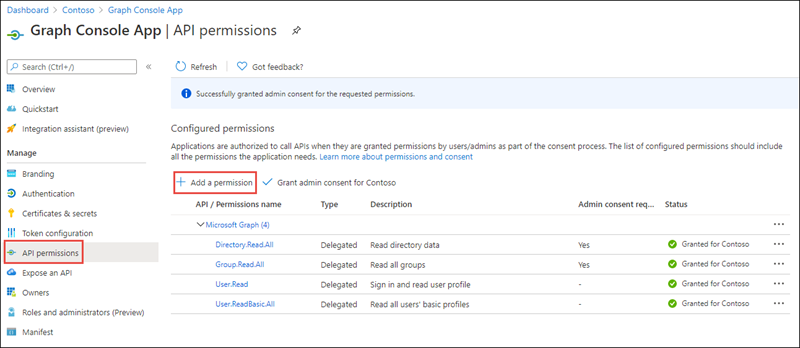
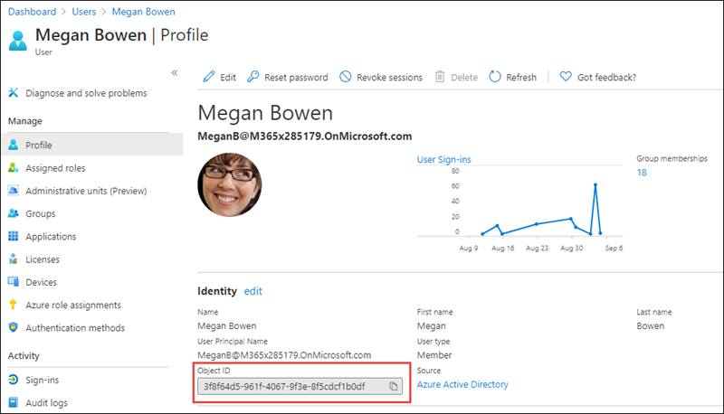

# Exercise 3: Manage group lifecycle

In this exercise, you'll modify the existing Azure AD application registration using the Azure Active Directory admin center, a .NET Core console application, and use Microsoft Graph to manage the lifecycle of Office 365 groups. You'll also learn how to provision a Microsoft Teams team from an existing Office 365 group.

> [!IMPORTANT]
> This exercise assumes you have created the Azure AD application and .NET console application from the previous unit in this module. You'll edit the existing Azure AD application and .NET console application created in that exercise in this exercise.

## Task 1: Update the .NET Core console app

In previous exercises, you created a .NET console application that retrieved and displayed various Office 365 group details on the console. Let's modify the application by removing the code specific to the last exercise.

In the **Program.cs** file, locate the following line in the `Main` method:

```csharp
var client = GetAuthenticatedGraphClient(config, userName, userPassword);
```

Delete or comment out all the code in the `Main` method after the above line.

## Task 2: Create an Office 365 group

In this section, you'll create a new Office 365 group. This requires an additional permission that the existing Azure AD application and .NET console app don't yet have. The first step is to grant the applications those permissions:

### Update permissions requested by the console app

An application must be granted specific permissions to get access to groups in Office 365. The existing console application is missing the necessary permission to do this.

Within the **Program.cs** file, locate the method `CreateAuthorizationProvider()`, and locate the following code:

```csharp
List<string> scopes = new List<string>();
scopes.Add("User.Read");
scopes.Add("Group.Read.All");
scopes.Add("Directory.Read.All");
```

These permissions need to be updated for the code you added in the last section. Remove the permission **Directory.Read.All** and request the permission **Group.ReadWrite.All**. The result should now look like the following code:

```csharp
List<string> scopes = new List<string>();
scopes.Add("User.Read");
scopes.Add("Group.ReadWrite.All");
```

### Grant additional permissions to the Azure AD application

The next step is to update and grant the new permission **Group.ReadWrite.All** to the Azure AD application.

Open a browser and navigate to the [Azure Active Directory admin center (https://aad.portal.azure.com)](https://aad.portal.azure.com). Sign in using a **Work or School Account** that has global administrator rights to the tenancy.

Select **Azure Active Directory** in the left-hand navigation. Locate the Azure AD app by selecting **Manage > App Registrations** and selecting the app **Graph Console App**:


Select **API Permissions** in the left-hand navigation panel.



Select the **Add a permission** button.

In the **Request API permissions** panel that appears, select **Microsoft Graph** from the **Microsoft APIs** tab.


When prompted for the type of permission, select **Delegated permissions**.

Enter **Group.R** in the **Select permissions** search box and select the **Group.ReadWrite.All** permission. Then select the **Add permission** button at the bottom of the panel to add the permissions to the app.

In the **Configured Permissions** panel, select the button **Grant admin consent for [tenant]**, and then select the **Yes** button in the consent dialog to grant all users in your organization this permission.

### Update console app to create an Office 365 group

Add the following `using` statement to the top of the **Program.cs** file with the other `using` statements:

```csharp
using System.Threading.Tasks;
```

To create a new Office 365 group, you need to submit the new group details to the `/groups` endpoint using an HTTP POST request. To do this, add the following method to the existing **Program.cs** file:

```csharp
private static async Task<Microsoft.Graph.Group> CreateGroupAsync(GraphServiceClient client) {
}
```

When creating a new group, the developer can specify the owners and members of the group using the `AdditionalData` property on the group object. First, locate the IDs of a few users you want to assign as owners and members to the group. To do this, within the Azure AD admin center, select **Manage > Users**. Select a wanted user from the list and copy their **Object ID** property:



Repeat this process a few more times to get the IDs of a few users.

Back in the .NET console app, add the following code to the new `CreateGroupAsync` method. Replace the IDs of the users in this code with the IDs you copied from the Azure AD admin center:

```csharp
// create object to define members & owners as 'additionalData'
var additionalData = new Dictionary<string, object>();
additionalData.Add("owners@odata.bind",
  new string[] {
    "https://graph.microsoft.com/v1.0/users/d280a087-e05b-4c23-b073-738cdb82b25e"
  }
);
additionalData.Add("members@odata.bind",
  new string[] {
    "https://graph.microsoft.com/v1.0/users/70c095fe-df9d-4250-867d-f298e237d681",
    "https://graph.microsoft.com/v1.0/users/8c2da469-1eba-47a4-9322-ee0ddd24d99a"
  }
);
```

Next, add the following code to the `CreateGroupAsync` method to create a new group object:

```csharp
var group = new Microsoft.Graph.Group
{
  AdditionalData = additionalData,
  Description = "My first group created with the Microsoft Graph .NET SDK",
  DisplayName = "My First Group",
  GroupTypes = new List<String>() { "Unified" },
  MailEnabled = true,
  MailNickname = "myfirstgroup01",
  SecurityEnabled = false
};
```

Finally, add the following code to the end of the `CreateGroupAsync` method to use the Microsoft Graph .NET SDK to create the new group:

```csharp
var requestNewGroup = client.Groups.Request();
return await requestNewGroup.AddAsync(group);
```

The last step is to call this new method from the `Main` method. Add the following code to the end of the `Main` method:

```csharp
// request 1 - create new group
Console.WriteLine("\n\nREQUEST 1 - CREATE A GROUP:");
var requestNewGroup = CreateGroupAsync(client);
requestNewGroup.Wait();
Console.WriteLine("New group ID: " + requestNewGroup.Id);
```

### Build and test the application

Run the following commands in a command prompt to compile and run the console application:

```console
dotnet build
dotnet run
```

After entering the username and password of a user, you'll see the console app display the new task's ID = 1. Let's see the group in Office 365.

Within a browser, navigate to https://www.outlook.com and sign-in with the same account you used to run the console app.

In the primary navigation, select **Groups > Manage Groups**.


On the next screen, select **Directory > All Groups** and locate the group you created. It may take a minute or two to appear while Office 365 provisions all the resources for the group.

After selecting the group, select the **Members** pivot to see a list of all users that have been added to the group. You should see both the owner(s) and member(s) you specified when creating the group:


## Task 3: Create a Microsoft Teams team from an Office 365 group

In this section, you'll create a Microsoft Teams team from the Office 365 group you created in the previous section.

First, to avoid any issues with duplicate groups, locate the following lines and comment them out in the `Main` method. This will keep the console app from creating another group:

```csharp
// request 1 - create new group
Console.WriteLine("\n\nREQUEST 1 - CREATE A GROUP:");
var requestNewGroup = CreateGroupAsync(client);
requestNewGroup.Wait();
Console.WriteLine("New group ID: " + requestNewGroup.Id);
```

The next step is to obtain the ID of the group you created in the previous section. Add the following code to the end of the `Main` method.

```csharp
// request 2 - teamify group
// get new group ID
var requestGroup = client.Groups.Request()
                                .Select("Id")
                                .Filter("MailNickname eq 'myfirstgroup01'");
var resultGroup = requestGroup.GetAsync().Result;
```

Now, add the following method to the **Program.cs** class. This method uses a `GraphServiceClient` and the group ID to create a Microsoft team under the existing Office 365 group:

```csharp
private static async Task<Microsoft.Graph.Team> TeamifyGroupAsync(GraphServiceClient client, string groupId)
{
  var team = new Microsoft.Graph.Team
  {
    MemberSettings = new TeamMemberSettings
    {
      AllowCreateUpdateChannels = true,
      ODataType = null
    },
    MessagingSettings = new TeamMessagingSettings
    {
      AllowUserEditMessages = true,
      AllowUserDeleteMessages = true,
      ODataType = null
    },
    ODataType = null
  };

  var requestTeamifiedGroup = client.Groups[groupId].Team.Request();
  return await requestTeamifiedGroup.PutAsync(team);
}
```

Call this method by adding the following code to the end of the `Main` method:

```csharp
// teamify group
var teamifiedGroup = TeamifyGroupAsync(client, resultGroup[0].Id);
teamifiedGroup.Wait();
Console.WriteLine(teamifiedGroup.Result.Id);
```

### Build and test the application

Run the following commands in a command prompt to compile and run the console application:

```console
dotnet build
dotnet run
```

After entering the username and password of a user, you'll see the console app display the new team ID. Let's see the team in Microsoft Teams.

Within a browser, navigate to https://teams.microsoft.com and sign-in with the same account you used to run the console app.

In the left-hand navigation, select **Teams**. You should see the team displayed in the list of **Your teams** as shown in the following screenshot. If it doesn't appear, wait a minute and refresh the page.


## Task 4: Delete an Office 365 group

In this section, you'll delete the Office 365 group you created in a previous section.

First, to avoid any issues with the previous sections, locate the following lines and comment them out in the `Main` method. This will keep the console app from creating another Microsoft Teams team:

```csharp
// teamify group
var teamifiedGroup = TeamifyGroupAsync(client, resultGroup[0].Id);
teamifiedGroup.Wait();
Console.WriteLine(teamifiedGroup.Result.Id);
```

Next, add the following method to the **Program.cs** file. This will delete the specified Office 365 group:

```csharp
private static async Task DeleteTeamAsync(GraphServiceClient client, string groupIdToDelete) {
  await client.Groups[groupIdToDelete].Request().DeleteAsync();
}
```

Finally, add the following code to the end of the `Main` method to call the method you previously added:

```csharp
// request 3: delete group
var deleteTask = DeleteTeamAsync(client, resultGroup[0].Id);
deleteTask.Wait();
```

### Build and test the application

Run the following commands in a command prompt to compile and run the console application:

```console
dotnet build
dotnet run
```

After entering the username and password of a user, the console app will display a message that the group has been deleted.

Confirm this by repeating the process from a previous section to find the group within Outlook.com. When looking at a list of groups, you'll notice the group is no longer present:


## Summary

In this exercise, you modified the existing Azure AD application registration using the Azure Active Directory admin center, a .NET Core console application, and used Microsoft Graph to manage the lifecycle of Office 365 groups. You also learned how to provision a Microsoft Teams team from an existing Office 365 group.
